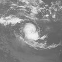
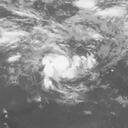
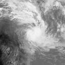
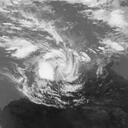
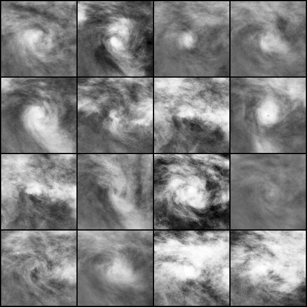
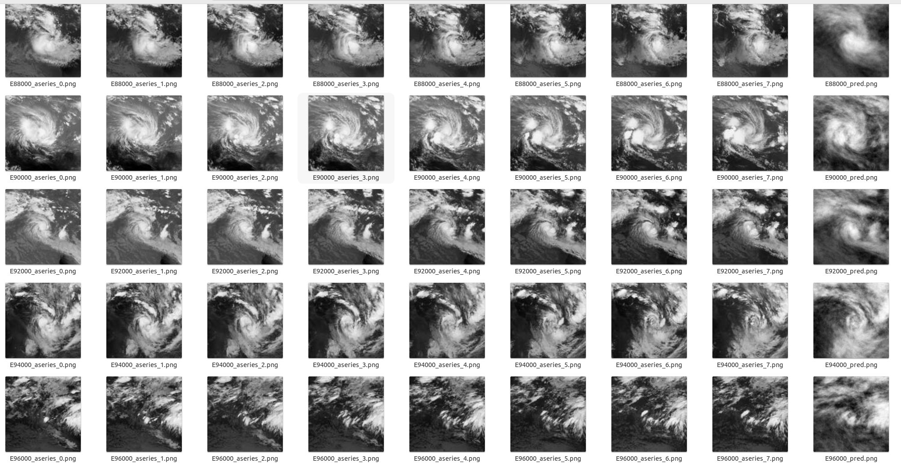

# Satellite Image Prediction Relying on GAN and LSTM Neural Networks
Unofficial implementation of Satellite Image Prediction Relying on GAN and LSTM Neural Networks,

Author : Zhan Xu∗ , Jun Du∗ , Jingjing Wang∗ , Chunxiao Jiang and Yong Ren∗
        
Original Paper : 
Satellite Image Prediction Relying on GAN and LSTM Neural Networks

~~~
In this project, WAGN and standard LSTM are used，
If you need to modify specific parameters, please refer to Config.py
~~~

 

### Usage 
~~~
install python 3.6+, torch==1.8.1, torchvision==0.9.1
pip install -r requirements.txt
~~~

### Data
~~~
128x128 Satellite remote sensing data, single channel

direction like this:

..my_data/
     download/
          W. South Pacific/
               1979/
                    197901/
                        1.jpg
                        2.jpg
                        3.jpg
                        .....
                    197902/
                    ...
               1980/
                    198001/
                    198002/
                    ...
               1981/
               ...
~~~

### train GAN
~~~
 run : python train_GAN.py
 result will be place in ./images and ./save_model
~~~

### train LSTM
~~~
  Look ./Config.py set load_G_name as you want.
  After setting the model of G in ./Config.py : python train_lstm.py
  
  result will be place in ./images_lstm and ./saved_model_LSTM
~~~

### single WGAN result

### real img:

### Single WGAN:

### LOCK_GAN LSTM:

